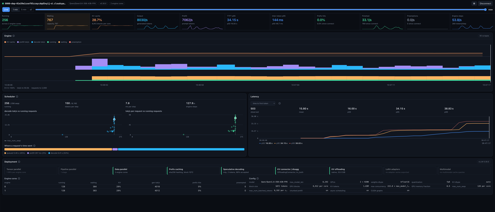

# vllm-inspector

A live view of what a vLLM engine is doing: batch and queue, token throughput, preemptions, latency over time, and how the deployment is laid out (data-parallel engine cores, TP and PP, scheduler limits).

A single-page app with no server of its own. The browser polls a vLLM server's `/metrics` once a second and keeps the last hour of scrapes in memory.



> [!NOTE]
> Use vllm-inspector to watch a real vLLM deployment while it serves traffic: is the batch full, are requests queuing, is the KV cache running out, how latency moves under load. It reads only the server's `/metrics`, so it shows what the engine is doing, not how it does it. To understand how vLLM works inside (scheduling, continuous batching, prefill and decode, KV cache blocks), still from a real inference but request by request and token by token, use [vllm-internals](https://github.com/marcotrinelli/vllm-internals).

## Quickstart

Start vLLM (any model):

```
vllm serve <model>
```

vLLM accepts cross-origin requests from any page by default (`--allowed-origins` defaults to `["*"]`). If you restrict origins, allow the inspector's:

```
vllm serve <model> --allowed-origins '["http://localhost:5273"]'
```

Then run the inspector and connect to `http://localhost:8000`:

```
npm install
npm run dev          # http://localhost:5273
```

To give the panels something to show, send a batch of concurrent completions (Python 3.10+, standard library only; the address comes from `VITE_VLLM_URL` in `.env`, or `--url`):

```
python3 examples/batch_client.py                # 64 requests, 16 in flight, 256 tokens each
python3 examples/batch_client.py -n 256 -c 64   # enough to queue requests and, on a small KV cache, preempt
```

The browser fetches `/metrics` directly (plus `/version`, `/v1/models` and `/server_info` every 30 s). `/server_info` only exists on a server started with `VLLM_SERVER_DEV_MODE=1`, which also turns on vLLM's other dev endpoints, so use it on a dev server only; without it the Deployment panel knows the data-parallel engine count but not TP, PP or the scheduler limits. Two things block a direct fetch: a server behind something that asks for credentials (a browser cannot send them past the CORS preflight), and an `https` page reaching an `http` address other than localhost. For the first, put a proxy next to the browser that adds the credentials and answers CORS, and connect to the proxy instead.

## Configuration

Copy `.env.example` to `.env`:

| Variable | Default | Meaning |
| --- | --- | --- |
| `VITE_VLLM_URL` | `http://localhost:8000` | Address the connect dialog offers, baked in at build time. `examples/batch_client.py` reads it too |

`?live=<vllm address>` in the page URL connects on load. The last address used is remembered in the browser.

## Scripts

| Script | What it does |
| --- | --- |
| `npm run dev` | Dev server on port 5273 (`npm run dev -- --host` to reach it from another machine) |
| `npm run build` | Typecheck, then a static site in `dist/` (relative paths, so any subpath works) |
| `npm run preview` | Serve the built `dist/` |
| `npm run typecheck` | `tsc --noEmit` |
| `npm test` | Vitest, against a recorded `/metrics` scrape in `src/fixtures/` |

## Panels

- KPI strip: running, waiting (split by reason), KV cache, output and prefill tok/s, TTFT and inter-token p95, prefix hit rate, finished/s, preemptions/s and engine steps/s, rates over the last 15 s at the playhead, each with a sparkline
- Engine: timeline of KV cache usage, prefill and decode tok/s, running and waiting requests, and preemptions. Click to move the playhead, press and drag to zoom to a range (the other panels follow it; `Esc` or × clears it); `Live` follows the newest scrape, `Window` picks 1 min, 5 min or the whole session
- Scheduler: decode tok/s and tok/s per request against the number of running requests, one dot per scrape, tokens per step against the step budget, and where a finished request's time went (queued, prefill, decode)
- Latency: p50, p95 and p99 over time for TTFT, inter-token, end-to-end, queue, prefill or decode time, each point over the 15 s before it; hover for the time and the values
- Deployment: what the server runs (tensor, pipeline and data parallel, prefix caching, speculative decoding, KV connector, KV offloading, LoRA, multimodal), one row per data-parallel engine core, and the cache and scheduler config

## What is measured

Everything comes from `/metrics` as vLLM reports it: counts, rates, latencies and KV utilisation. `/metrics` has no per-request data and no block table, so requests are counted, not named, and the KV cache shows how many tokens are held, not which request holds them. Counters are shown relative to the first scrape of the session; an engine restart (a new `process_start_time_seconds`) clears the history.

## Keys

Space toggles following the newest scrape, arrows step 0.1 s (shift: 1 s), Esc clears a picked range.

## Contributing

Issues and pull requests are welcome. Run `npm run typecheck` and `npm test` before opening a pull request.

## License

MIT
